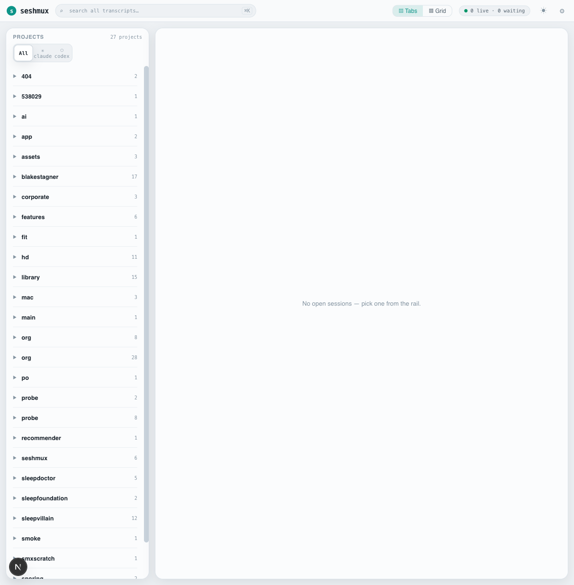
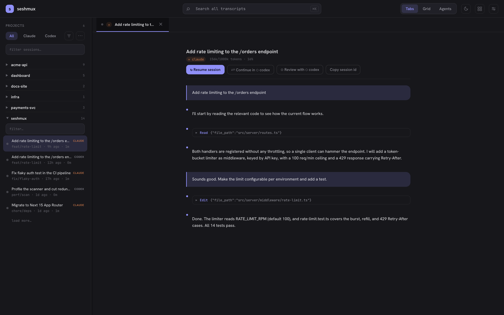

# seshmux

**Local-first mission control for your AI coding agents.** One command, `npx seshmux`, opens a browser app that browses and searches every Claude Code and Codex session on your machine, runs live agent sessions in embedded terminals, spins up isolated git-worktree workspaces for parallel agents, and bridges the two agents together — all served from your own laptop, with zero hosting.

seshmux works with **✳ Claude Code** and **⬡ Codex**. It reads the sessions they already write to disk; you don't change how you use either tool.

> seshmux is an independent project, not affiliated with or endorsed by Anthropic or OpenAI.

---

## Table of contents

- [Why](#why)
- [Quickstart](#quickstart)
- [Feature guide](#feature-guide)
  - [Session archive](#session-archive)
  - [Live terminals](#live-terminals)
  - [Agents view — mission control board](#agents-view--mission-control-board)
  - [Subagent viewer](#subagent-viewer)
  - [Customizations browser](#customizations-browser)
  - [Layout — hide projects, resize panes](#layout--hide-projects-resize-panes)
  - [Workspaces — parallel agents via git worktrees](#workspaces--parallel-agents-via-git-worktrees)
  - [Status system — working / waiting / done](#status-system--working--waiting--done)
  - [Deep agent integration (status hooks)](#deep-agent-integration-status-hooks)
  - [Notifications](#notifications)
  - [The cross-agent bridge](#the-cross-agent-bridge)
  - [Detection manifests (add or fix an agent without a rebuild)](#detection-manifests-add-or-fix-an-agent-without-a-rebuild)
  - [Status explain (debugging the dot)](#status-explain-debugging-the-dot)
- [Architecture](#architecture)
- [Updates that never kill a session](#updates-that-never-kill-a-session)
- [Security model](#security-model)
- [HTTP API](#http-api)
- [Configuration](#configuration)
- [Development](#development)
- [Troubleshooting](#troubleshooting)
- [Compared to cmux](#compared-to-cmux)
- [License](#license)

---

## Why

Agent sessions pile up as scattered `.jsonl` files you can't search, across two tools that don't talk to each other. Running two agents on one repo means they stomp each other's working tree. And nothing tells you *which* of your five running agents needs you right now.

seshmux is the archive-and-orchestration half of agent tooling: it gives your session history a home, keeps live sessions alive through restarts and updates, isolates parallel agents in worktrees, and lets the two agents collaborate — without sending anything off your machine.

## Quickstart

```bash
npx seshmux
```

Opens `http://127.0.0.1:4700` in your browser. No account, no config, no server to host.

### Requirements

| Dependency | Required? | What it unlocks |
| --- | --- | --- |
| Node ≥ 20 + npm | required | everything |
| `claude` CLI (Claude Code) | required | if no agent CLI is found, seshmux shows a setup screen |
| `codex` CLI | optional | Codex sessions + the cross-agent bridge |
| `tmux` | optional | tier-2 persistence: sessions survive even a daemon restart |
| `git` | optional | Workspaces (worktree isolation) |
| `rg` (ripgrep) | optional | faster full-text search (falls back to a built-in scan) |

---

## Feature guide

### Session archive

Every session from `~/.claude` and `~/.codex`, in one place.

- **Projects rail** — sessions are grouped into projects by repo working directory. Sessions from *both* agents in the same repo appear under one project, with per-provider counts. Pin projects to keep them on top; the filter/sort menu narrows by provider, recency, or name. Projects whose repo directory no longer exists are hidden automatically.
- **Full-text search** — search months of history across both agents' transcripts (ripgrep-accelerated when available).
- **Transcript view** — read any past session: user/assistant turns, tool calls, and a context-window meter showing how full the session's context was at each point.
- **Context meters** — live sessions show a ticking context meter in the rail and status bar, computed from the provider's own transcript data. Window sizes are model-aware: 1M-context models (Opus 4.5+, Fable/Mythos 5) are measured against 1M, others against 200k — so the percentage matches what the agent's own TUI reports.
- **Resume from anywhere** — any archived session can be resumed (`claude --resume` / `codex resume`) into a live terminal with one click.

### Live terminals

Start, continue, or resume sessions in embedded xterm.js terminals.

- **Tabs and grid** — run sessions in a tab strip or a multi-pane grid view. Multiple browser windows can attach to the same session (last resize wins on size, by design).
- **Detach-safe** — terminals are owned by the `seshmuxd` daemon, not the server or the browser. Refresh the page, restart the server, update seshmux: the agent keeps running and your terminal reattaches with scrollback intact.
- **Two persistence tiers:**
  - **Tier 1 (always on):** the daemon holds a per-session scrollback ring buffer. Survives any browser/server restart.
  - **Tier 2 (`tmux` installed):** sessions run inside tmux (`seshmux-<repo>-<n>`), so even a *daemon* restart survives — the daemon re-adopts sessions by name on startup, and you can `tmux attach` from any terminal. Sessions are stamped with their owning config dir (a `@seshmux-config` tmux option), so a second seshmux instance on the same machine never hijacks them.

### Agents view — mission control board

A third view (next to Tabs and Grid) that answers *"what are all my agents doing?"* at a glance.

- **Kanban board over live sessions** — four columns: **needs input · working · done · idle**, each card showing title, provider, branch, age, and duration. Click a done card to jump to its tab (and drain the Done column).
- **Four-state counter in the top nav** — the same rollup as a compact segmented counter, visible from every view; zero segments hide themselves. Counter and board share one selector, so they can never disagree.
- Status truth comes from the same classifier as the rail dots — including the guarantee that *viewing* a finished agent never flips it back to "working" (repaints don't count as activity; only real output does).

### Subagent viewer

When a session spawns subagents (Task/Explore agents, workflow fleets), a **`◦ N agents`** chip appears in its status bar. Click it:

- **Tree + detail split** beside the terminal — every subagent the session spawned (including nested forks and workflow runs), with status, label, model, token usage, and duration.
- Select an agent to read its **full transcript**: the prompt it was given, its tool activity, and its final outcome.
- Live: the chip count and tree update as agents spawn and finish, no reload.

### Customizations browser

Browse the agent-side configuration that shapes your sessions — skills, agents, instructions (CLAUDE.md), hooks, and MCP servers — for both providers, global and per-project, in one modal. The Projects panel doubles as the show/hide control for the rail (below).

### Layout — hide projects, resize panes

- **Hide projects** — the **⋯** button at the end of the rail's filter row opens a Projects modal: toggle any project off to hide it from the rail (persisted server-side, shared with the Customizations browser's Projects panel).
- **Resizable rail** — drag the rail's right edge (floor = default width, so it never collapses); double-click resets.
- **Resizable split** — with the subagent viewer open, drag the divider between terminal and viewer; the terminal live-refits as you drag. Double-click resets to 50/50. Both sizes persist across reloads.

### Workspaces — parallel agents via git worktrees

One click gives an agent its own isolated checkout. Two agents can work the same repo simultaneously without touching each other's files.

**Creating:**
- Hover a project row in the rail → click **⊕** (next to pin / scratchpad / +). No dialog: seshmux creates a branch `agent/<adjective>-<noun>-<n>` (e.g. `agent/quiet-otter-1`) off the default branch's HEAD, adds a git worktree under `~/.config/seshmux/worktrees/<repo>/`, and spawns a new agent session with its cwd inside it. Provider and spawn mode default to the project's usual ones.
- The **New session** modal has a "New workspace" option if you want to pick the provider/mode explicitly.

**While it runs:**
- Workspace sessions list under their *parent* project (not as a separate project), marked with **⑃** next to the branch name.
- The terminal status bar shows a workspace chip: `workspace · agent/quiet-otter-1 · N files changed` (dirty count refreshes lazily on focus).

**Finishing** — close the workspace tab (or hit **⌫** on the chip) and pick one of three:

| Option | What happens |
| --- | --- |
| **Merge** | `git merge --no-ff <branch>` into the default branch. On conflict, the error is surfaced and *nothing* is changed — resolve manually. |
| **Keep branch** | Worktree is removed, the branch survives for a later manual merge/PR. |
| **Discard** | Worktree force-removed and branch deleted. If the tree is dirty, you must type `discard` to confirm — uncommitted work is never silently destroyed. |

**Details worth knowing:**
- All git operations run via `execFile` with argument arrays — no shell interpolation, repo paths validated against known projects.
- On boot the server reconciles its workspace records against `git worktree list`, pruning orphans from crashes on either side.
- A fresh worktree has no `node_modules` — the agent can install, or you can. Noted in the create toast.
- Codex note: every new worktree is an untrusted directory to codex, so its folder-trust dialog appears first.
- Branch-name collisions bump the `-<n>` counter; nothing is ever force-created.

### Status system — working / waiting / done

Every live session carries a status dot, rolled up to its project row so the rail answers *"which project needs me?"*

| Status | Meaning | How it's detected |
| --- | --- | --- |
| **working** | agent is actively generating | live output activity (spinners, ticking counters) |
| **waiting** | agent is blocked on your input | prompt/option-list chrome in the latest frame, or a status hook |
| **done (unviewed)** | agent finished while you weren't looking | client-side: a working→idle transition on an unfocused tab |
| **idle** | quiet, nothing pending | ≳20s of silence with no prompt on screen |

- Rollup precedence on a project row: **waiting > done-unviewed > working > idle** — the most actionable state wins.
- The done-unviewed marker clears the moment you focus the tab.
- Heuristic detection strips ANSI and matches against per-provider pattern manifests (see [Detection manifests](#detection-manifests-add-or-fix-an-agent-without-a-rebuild)); "working" always beats "waiting" because a live agent redraws continuously while a blocked one draws its prompt once and goes silent.

### Deep agent integration (status hooks)

Heuristics are good; hooks are exact. **Settings → Deep agent integration** installs real Claude Code lifecycle hooks (Notification / Stop / permission-request) that report status the instant it changes — a permission prompt flips the dot to *waiting* in under a second, no pattern matching involved.

- **Opt-in, default OFF** — it modifies `~/.claude/settings.json`, so seshmux never does it silently. Install and uninstall are one click; uninstall restores your settings file exactly (only seshmux's own hook entry is ever touched, written atomically).
- Hook-reported status **overrides** heuristics while fresh (~30s); heuristics remain the fallback for hook-less agents and stale files.
- Versioned: if seshmux ships a newer hook script, it reinstalls on drift automatically.
- Codex has no hook mechanism in current releases, so it stays heuristics-only (the Settings panel shows per-provider availability).

Prefer wiring it yourself? The hook contract is just a file: write `{ "status": "waiting" }` (`working` | `waiting` | `idle`) to `~/.config/seshmux/status/<ptyId>.json` — the spawned process finds its own id in `$SESHMUX_PTY_ID`. seshmux watches the directory and picks changes up in under a second.

### Notifications

macOS notifications fire when a session in a **hidden** tab:

- **needs input** (the original behavior), or
- **finishes** — new; toggle with **Settings → notifyOnDone** (default on).

Both respect the **macNotifications** master toggle. Delivered via `osascript` with argument-array binding (a malicious session title can't inject AppleScript). No-op on non-macOS.

### The cross-agent bridge

The bridge is what makes two agents a team instead of two tabs.

- **Handoff** — send a session from one agent to the other with an auto-composed brief of what's been done and what's left.
- **Cross-review** — have the *other* agent adversarially review your current diff.
- **Plan-off** — both agents plan the same task read-only, side by side; you pick the winner.
- **Shared scratchpad** — a per-repo `.seshmux/handoff.md` both agents can read/write, live-refreshed in the UI.
- **MCP bridge** — registers an MCP server with both CLIs so a running agent can call, mid-session:

| MCP tool | What it does |
| --- | --- |
| `ask_claude` / `ask_codex` | ask the other agent a question, get the answer inline |
| `wait_for_status` | block until another session reaches `waiting` or `idle` — event-driven (no polling), capped at 600s, timeout returned as data (`{status:"timeout"}`), never throws |
| `read_terminal` | read the last N lines (≤500) of another session's terminal, ANSI-stripped; refuses the caller's own session |

`wait_for_status` + `read_terminal` turn the bridge into a coordination layer: *"hand this to codex, wait until it's idle, read its terminal, and summarize what it did."*

Guard rails on everything: a **hop budget** (bridged calls can't ping-pong forever), a **loop guard** (A-waits-B-waits-A is refused), and an optional **approval flow** — each cross-agent call pops an approval toast in the UI before it runs.

### Detection manifests (add or fix an agent without a rebuild)

The needs-input heuristics' "waiting" patterns are **data, not code**. Each provider ships a manifest:

```
server/lib/providers/manifests/claude.json
server/lib/providers/manifests/codex.json
```

— a list of regex sources compiled with the `i` flag at boot. To override, drop a whole-file replacement at:

```
~/.config/seshmux/manifests/<provider>.json
```

Missing or malformed override → seshmux logs a warning and falls back to the shipped manifest. When an agent TUI update changes its prompt chrome, you can hot-patch detection yourself without waiting for a release.

Adding a whole new agent = a provider module (`server/lib/providers/<agent>.ts`: store paths, transcript parsing, spawn/resume commands) plus a manifest. Nothing outside `server/lib/providers/` knows any agent's binary name or on-disk layout — that's an enforced architectural rule, so the rest of the app needs zero edits.

### Status explain (debugging the dot)

When a status dot looks wrong, ask the classifier to show its work:

```bash
curl -H "x-seshmux-token: <token>" "http://127.0.0.1:4700/api/term/<ptyId>/status-explain"
```

Returns the current status plus evidence: which manifest pattern matched, which precedence branch decided (activity / prompt-frame / silence), milliseconds since last output, whether a hook override beat the heuristics (and the hook file's age), and the last ~20 ANSI-stripped lines that were classified.

---

## Architecture

Three pieces ship in one npm package; `bin/seshmux.js` supervises all of them.

```
┌────────────────────────── your machine ──────────────────────────┐
│                                                                   │
│  browser (Next.js UI + xterm.js)                                  │
│      │  HTTP + WebSockets (token-authed)                          │
│  server (Fastify) ── stateless, safe to restart/update            │
│      │  JSON-RPC over unix socket (protocol v1, frozen)           │
│  seshmuxd daemon ── owns every agent PTY, survives everything     │
│      │                                                            │
│  agent processes (claude / codex), optionally inside tmux         │
│                                                                   │
│  ~/.claude  ~/.codex ── read-only session stores (the archive)    │
└───────────────────────────────────────────────────────────────────┘
```

- **`daemon/` — seshmuxd.** Plain Node, zero build step, one dependency (`node-pty`). Owns every agent child process, keeps per-PTY scrollback ring buffers, speaks a deliberately frozen JSON-RPC protocol over a unix socket. Deliberately boring so it almost never needs to change — which is what lets everything *else* update freely.
- **`server/` — Fastify.** Serves the built UI, the REST API, and WebSockets bridging xterm.js to the daemon. Completely stateless: kill it, update it, `kill -9` it — sessions don't notice. Also hosts the events hub (status classification, context meters, approval toasts, scratchpad watches) and the bridge (including two auxiliary unix sockets, `approval.sock` and `wait.sock`, that the MCP bridge process dials — both self-heal if a crashed server leaves them stale).
- **`app/`, `components/`, `lib/client/` — Next.js 15 UI.** App Router, SCSS modules, a strict three-layer style system (design tokens → typography mixins → UI primitives) enforced by a lint gate.

Session data flows one way: providers parse `~/.claude` and `~/.codex` on demand; seshmux never writes to either store.

## Updates that never kill a session

When a new version ships, seshmux updates the **server only**. The server exits with a sentinel code, the supervisor relaunches it on the new version, the browser reconnects automatically — and the daemon, with every live agent session it holds, keeps running straight through. A crash-loop guard stops relaunching (with rollback instructions) if a bad update restarts more than 3× in 60s.

- Installed globally (`npm i -g seshmux`) → in-app update button.
- Run via `npx` → the npx cache is per-invocation; run `npx seshmux@latest` next time.

This invariant — *nothing may kill daemon-owned PTYs during a server update* — is tested by a dedicated session-survival gate before every release.

## Security model

seshmux serves a web app that can spawn shells, so localhost binding alone is not treated as a boundary. Two layers guard every API call and WebSocket upgrade:

1. **Origin check** — every state-changing request and every WS upgrade must originate from `http://127.0.0.1:<port>` (or `localhost`); cross-site requests are rejected.
2. **Per-process token** — a random 32-byte token is generated at launch, embedded in the served page, and required on every `/api/*` call and WS upgrade. Never written to disk.

Other postures:

- All git and `osascript` invocations use `execFile` with argument arrays — no shell, no string interpolation of user/agent-derived values.
- Cross-agent MCP calls can require in-UI approval before executing.
- Everything stays on your machine. The only outbound call is an optional 6-hour version check against the npm registry (offline-safe — never blocks or fails the app).

## HTTP API

All endpoints require the per-process token. The interesting ones:

| Endpoint | Purpose |
| --- | --- |
| `GET /api/projects` | merged project list (both providers), session counts, missing-repo flags |
| `GET /api/term/:ptyId/status-explain` | classifier evidence for a live session's status |
| `POST /api/workspaces` | create worktree + branch + spawn a session in it |
| `GET /api/workspaces?project=` | list a project's workspaces with dirty counts |
| `DELETE /api/workspaces` | finish a workspace (`mode: merge \| keep \| discard`, `force` for dirty discard) |
| `POST /api/bridge/wait` | REST twin of the `wait_for_status` MCP tool |
| `GET /api/bridge/peek` | REST twin of `read_terminal` |
| `GET /api/env` | detected CLIs, bridge registration status, per-provider spawn-command previews |
| `GET /api/hooks/status` · `POST /api/hooks/install` · `uninstall` | status-hook integration management |

## Configuration

| Variable | Default | Notes |
| --- | --- | --- |
| `PORT` | `4700` | server port |
| `SESHMUX_CONFIG_DIR` | `~/.config/seshmux` | holds daemon/bridge sockets, workspace records, manifest overrides, status files. **Keep it short** — macOS caps unix-socket paths at ~104 chars |

In-app **Settings** cover theme (light/dark), macOS notifications, notify-on-done, and the status-hook integration.

## Development

```bash
npm run dev          # dev server (tsx). A predev hook ensures the daemon is up first.
npm test             # style-lint gate, then the full vitest suite
npm run lint:styles  # bans raw font properties outside the typography layer
npm run build        # Next.js standalone bundle via scripts/build-standalone.sh
```

- Tests are hermetic: real temp git repos (never mocked git), real daemon spawns, injected dependencies — and the whole suite runs against a **private tmux server** (`TMUX_TMPDIR`) so test daemons can never touch your real sessions.
- Architectural rules enforced in review/CI: all session spawning flows through one seam (`server/session-start.ts`); the daemon protocol is frozen at v1 (additive changes only); no agent binary name or store path outside `server/lib/providers/`; all text styling through typography mixins.
- Domain deep-dives live in `.claude/skills/` (style-system, provider-abstraction, daemon-protocol, agent-bridge).

## Troubleshooting

**Terminals show "disabled" / live sessions won't start.** The daemon and bridge speak over unix sockets in the config dir, and macOS caps a socket path at **104 characters**. A long `SESHMUX_CONFIG_DIR` makes the daemon fail to bind (`EINVAL`) and seshmux degrades to browse-only. Keep the config dir path short — the default is well within the limit.

**A status dot looks wrong.** `GET /api/term/<ptyId>/status-explain` shows exactly which pattern or hook produced it. If an agent update changed its TUI, drop a manifest override (see [Detection manifests](#detection-manifests-add-or-fix-an-agent-without-a-rebuild)).

**MCP approval/wait stopped responding after a crash.** Fixed in current versions — the server now detects and reclaims stale `approval.sock`/`wait.sock` files on boot. If you're on an older version, delete the two `.sock` files in the config dir and restart.

## Compared to cmux

[cmux](https://github.com/manaflow-ai/cmux) (by manaflow) is a native macOS terminal for running agents in parallel — a different product solving a different problem. seshmux is a browser app focused on the **archive + orchestration** side: cross-agent session history, search, context meters, workspaces, handoff, review, and plan-off. They are not affiliated; if you want a native parallel-agent terminal, cmux is worth a look.

## Screenshots

| Light | Dark |
| --- | --- |
|  |  |

## License

MIT — see [LICENSE](./LICENSE).

---

Provider marks (✳ Claude Code, ⬡ Codex) are generic glyphs, not official logos. Product names are used descriptively for interoperability only.
